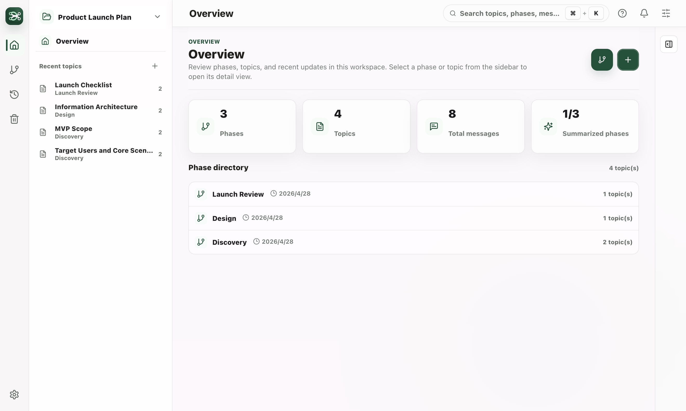
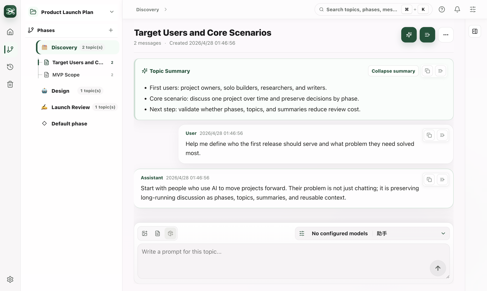

# Mindline

[中文](./README.md)

Mindline is a local-first AI thinking workspace. It organizes conversations into phases and topics, so you can move projects forward, review decisions, preserve long-running thinking, and reuse existing material as context for new discussions.

It is not just a chat history window. Mindline is designed around one practical goal: helping you keep questions, conclusions, phase summaries, and portable Markdown data inside your own project workspace.

## Screenshots





## Who It Is For

- People who discuss the same project with AI over a long period of time.
- People who want separate topics instead of one long mixed conversation.
- People doing project reviews, product thinking, research notes, writing plans, or technical design work.
- People who want conversation data stored in a local project folder.
- People who switch between multiple model providers while keeping one workflow.

## Core Concepts

### Workspace

A workspace is a local project folder you choose. Mindline stores phases, topics, messages, and summaries inside that folder. You can use different folders for different projects.

### Phase

A phase groups related topics, such as "Discovery", "Design", "Implementation", or "Launch review". A phase can have its own summary and can be ended, restored, or moved to trash.

If no phase is specified, new topics go into the default phase. The default phase behaves like a normal second-level phase in the UI.

### Topic

A topic is an independent AI conversation thread. Each topic has its own messages, summary, phase assignment, and Markdown data.

### Context Basket

You can add messages, topics, topic summaries, or phase summaries to the context basket, then start a new discussion using those selected materials. This is useful for cross-topic review, synthesis, and decision making.

## Quick Start

1. Launch Mindline.
2. Choose a local project folder as the workspace.
3. Open Settings, then add and enable a model provider.
4. Create a phase, or create a topic directly inside the default phase.
5. Ask a question in the topic composer.
6. Generate a topic or phase summary when you want to preserve conclusions.
7. Add useful material to the context basket for follow-up discussions.
8. Export Markdown when you need an archive or shareable document.

## Main Features

- Phase and topic management: organize topics by phase, with folding, renaming, moving, ending, restoring, and trash.
- Multi-provider AI chat: use local tools or cloud API providers and switch the active model.
- Streaming replies: model responses appear as they are generated and can be cancelled.
- Summaries: generate structured summaries for individual topics or entire phases.
- Context basket: combine messages, topics, and summaries for a second discussion.
- Search: search phases, topics, messages, topic summaries, and phase summaries.
- Markdown export: export topics or phases; headings follow the current UI language.
- Backups: back up Mindline data with Git and connect an existing remote repository for sync.
- Themes and languages: Chinese and English UI, plus multiple themes.
- Keyboard preferences: configure Enter-to-send behavior while keeping Cmd/Ctrl + Enter as explicit send.

## Common Actions

### Create a Phase

Click "New phase". Mindline immediately jumps to the phase list draft and focuses the name input. Enter a phase name to create and open it.

### Create a Topic

Click "New topic". Mindline immediately jumps to the target phase and opens a topic-name draft input under that phase. If no target phase is specified, the topic is created in the default phase.

Shortcut: `Cmd/Ctrl + N`.

### Move a Topic

Right-click a topic in the sidebar, choose "Move to phase", then select the target phase. The default phase is also available as a normal target.

### Generate a Summary

Use the summary button on a topic or phase page. The summary is saved to the corresponding `summary.md` and remains available when you reopen the workspace.

### Use the Context Basket

Click "Add context" on a message, topic, or summary. The context basket collects the selected material so you can start a new discussion with it.

### Export Markdown

Use the more menu on a topic or phase page and choose "Export Markdown". Mindline asks where to save the file and does not overwrite source data.

## Model Providers

Mindline supports two provider types:

| Type | Best For |
| --- | --- |
| Local tools | Calling tools such as Claude Code, Codex, OpenClaw, or custom local commands |
| Cloud models | Calling cloud models with an API key, API URL, model name, and protocol |

Cloud protocols include OpenAI Chat Completions and Anthropic Messages. API keys are stored separately in the local user directory and are not written into the project folder.

## Data and Privacy

Mindline stores project knowledge in the workspace folder you choose:

```text
{project}/
  .mindline/
    manifest.json
  topics/
  phases/
```

Local preferences, model provider configuration, and secrets are stored in the user directory:

```text
~/.mindline/
  config.json
  model-providers/
    config.json
    secrets/
```

Notes:

- `topics/` and `phases/` are visible project knowledge assets, so you can inspect, move, and back them up.
- `.mindline/` stores internal indexes and workspace metadata.
- API keys are stored in `~/.mindline/model-providers/secrets/` and are not written to project Git.
- Backup only manages Mindline data. It does not take over your project code or your own `.git`.
- Older data layouts are migrated automatically when a workspace opens. Old source directories are kept so you can verify or roll back.

## Keyboard Shortcuts

| Action | Shortcut |
| --- | --- |
| Search | `Cmd/Ctrl + K` |
| New topic | `Cmd/Ctrl + N` |
| Send message | `Enter`, configurable in Settings |
| New line | `Shift + Enter` |
| Explicit send | `Cmd/Ctrl + Enter` |
| Close panel or cancel generation | `Esc` |
| Switch topic | `Cmd/Ctrl + Shift + [` / `]` |

## Run From Source

If you use Mindline from source:

```bash
npm install
npm run dev
```

Useful checks:

```bash
npm run typecheck
npm test
npm run build
```

Package locally for macOS:

```bash
npm run package:mac
npm run dist:mac
```

## Troubleshooting

### Existing Workspace Is Not Found

Choose the original project folder, not only its `topics/` or `phases/` subfolder. Mindline will read or create `.mindline/manifest.json` automatically.

### Model Calls Fail

Check:

- The active provider is correct.
- The API key belongs to the selected platform.
- The protocol matches the provider requirement.
- The API URL and model name are complete.

### macOS Says the Developer Cannot Be Verified

If you are using an unsigned internal build, macOS may show a verification warning. Open the app from Finder with right-click, then choose Open. Public distribution builds should use Developer ID signing and notarization.

## Current Status

Mindline is still iterating quickly, but it already includes local workspaces, phase and topic management, model providers, streaming replies, summaries, context basket, search, Markdown export, backups, themes, and keyboard settings.
