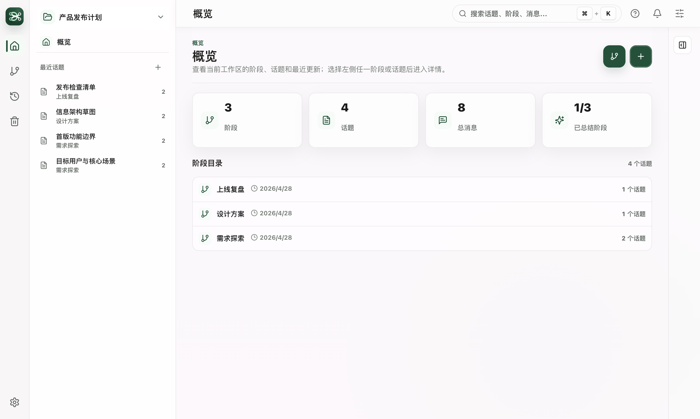
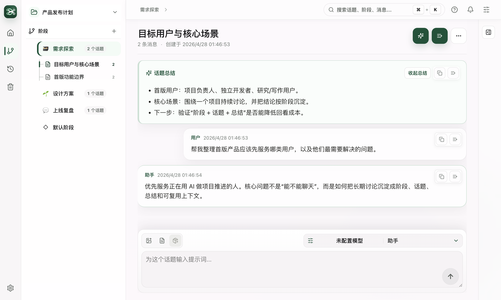

# Mindline（心线）

[English](./README.en.md)

Mindline（心线）是一款本地优先的 AI 思考工作区。它把对话整理成「阶段」和「话题」，适合用来推进项目、复盘决策、沉淀长期思考，并在需要时把已有内容作为上下文继续讨论。

它不是一个只保存聊天记录的窗口。Mindline 更关注一件事：让你在一个项目里持续积累问题、结论、阶段总结和可迁移的 Markdown 数据。

## 界面预览





## 适合谁

- 需要围绕一个项目长期和 AI 讨论的人。
- 希望把不同问题拆成多个话题，而不是混在同一条长对话里的人。
- 经常做项目复盘、产品思考、研究整理、写作规划或技术方案推演的人。
- 希望聊天内容保存在自己本地项目目录，而不是只留在云端产品里的人。
- 需要在不同模型供应商之间切换，并保留统一工作流的人。

## 核心概念

### 工作区

工作区是你选择的一个本地项目目录。Mindline 会在这个目录里保存阶段、话题、消息和总结。你可以为不同项目选择不同目录。

### 阶段

阶段用来承接一组相关话题，例如「需求探索」「设计方案」「开发实现」「上线复盘」。阶段可以生成总结，也可以结束、恢复或移到回收站。

如果你没有指定阶段，新话题会进入默认阶段。默认阶段现在也按普通二级阶段使用，不需要额外理解特殊规则。

### 话题

话题是一条独立的 AI 对话线。每个话题都有自己的消息、总结、所属阶段和 Markdown 数据。

### 上下文篮

你可以把消息、话题、话题总结或阶段总结加入上下文篮，再基于这些材料发起一次新的讨论。它适合做跨话题整理、复盘和决策对比。

## 快速开始

1. 启动 Mindline。
2. 选择一个本地项目目录作为工作区。
3. 打开「设置」，添加并启用模型供应商。
4. 新建阶段，或直接在默认阶段中新建话题。
5. 在话题中输入问题并发送。
6. 需要沉淀时，生成话题总结或阶段总结。
7. 需要复用材料时，把内容加入上下文篮继续讨论。
8. 需要归档或分享时，导出 Markdown。

## 主要功能

- 阶段与话题管理：按阶段组织话题，支持折叠、重命名、移动、结束、恢复和回收站。
- 多模型对话：支持本地工具和云端 API 供应商，可切换默认启用模型。
- 流式回复：模型回复会实时显示，生成中可以取消。
- 总结沉淀：可为单个话题或整个阶段生成结构化总结。
- 上下文篮：把多个消息、话题或总结组合起来，发起二次讨论。
- 搜索：搜索阶段、话题、消息、话题总结和阶段总结。
- Markdown 导出：导出话题或阶段，导出标题会跟随当前界面语言。
- 备份：通过 Git 备份 Mindline 数据，可连接已有远端仓库同步备份。
- 主题与语言：支持中文、英文界面和多套主题。
- 快捷键偏好：支持配置 Enter 发送或换行，并保留 Cmd/Ctrl + Enter 发送。

## 常用操作

### 新建阶段

点击「新建阶段」后，Mindline 会立即跳到阶段列表中的新建草稿，并聚焦名称输入框。输入阶段名后确认即可创建并打开该阶段。

### 新建话题

点击「新建话题」后，Mindline 会立即跳到目标阶段，并在该阶段下打开新建话题输入框。没有目标阶段时，话题会创建在默认阶段。

快捷键：`Cmd/Ctrl + N`。

### 移动话题

在侧边栏右键话题，选择「移动到阶段」，再选择目标阶段。默认阶段也会作为普通可选目标出现。

### 生成总结

在话题页或阶段页点击总结按钮。总结会保存到对应的 `summary.md`，以后重新打开也能继续查看。

### 使用上下文篮

在消息、话题或总结上点击「加入上下文」。右侧上下文篮会收集这些材料，你可以用它们发起新的讨论。

### 导出 Markdown

在话题页或阶段页的更多菜单中选择「导出 Markdown」。导出会通过系统保存对话框选择目标路径，不会覆盖原始数据。

## 模型供应商

Mindline 支持两类模型接入：

| 类型 | 适合场景 |
| --- | --- |
| 本地工具 | 通过命令行或本地配置调用 Claude Code、Codex、OpenClaw 等工具 |
| 云端模型 | 通过 API Key、API 地址、模型名和协议调用云端模型 |

云端协议支持 OpenAI Chat Completions 和 Anthropic Messages。API Key 会单独保存在本机用户目录，不写入项目目录。

## 数据与隐私

Mindline 默认把知识数据保存在你选择的项目目录里：

```text
{project}/
  .mindline/
    manifest.json
  topics/
  phases/
```

本机偏好、模型供应商配置和密钥保存在用户目录：

```text
~/.mindline/
  config.json
  model-providers/
    config.json
    secrets/
```

说明：

- `topics/` 和 `phases/` 是项目知识资产，便于你直接查看、迁移和备份。
- `.mindline/` 保存内部索引和工作区元信息。
- API Key 存在 `~/.mindline/model-providers/secrets/`，不会写入项目 Git。
- 备份功能只管理 Mindline 数据，不接管你的项目代码和用户自己的 `.git`。
- 旧版本数据会在打开工作区时自动迁移；迁移前的旧目录会保留，便于核对和回退。

## 快捷键

| 操作 | 快捷键 |
| --- | --- |
| 搜索 | `Cmd/Ctrl + K` |
| 新建话题 | `Cmd/Ctrl + N` |
| 发送消息 | `Enter`，可在设置里改为换行 |
| 换行 | `Shift + Enter` |
| 显式发送 | `Cmd/Ctrl + Enter` |
| 关闭面板或取消生成 | `Esc` |
| 切换话题 | `Cmd/Ctrl + Shift + [` / `]` |

## 从源码运行

如果你是从源码使用 Mindline：

```bash
npm install
npm run dev
```

常用检查：

```bash
npm run typecheck
npm test
npm run build
```

macOS 本地打包：

```bash
npm run package:mac
npm run dist:mac
```

## 故障排查

### 找不到已有工作区

请选择原项目目录，而不是只选择其中的 `topics/` 或 `phases/` 子目录。Mindline 会自动读取或创建 `.mindline/manifest.json`。

### 模型调用失败

请检查：

- 当前启用的供应商是否正确。
- API Key 是否属于对应平台。
- 协议是否匹配供应商要求。
- API 地址和模型名是否填写完整。

### macOS 提示无法验证开发者

如果你使用的是未签名的内测包，macOS 可能提示无法验证开发者。可以在 Finder 中右键应用并选择打开。正式分发版本应使用 Developer ID 签名和 notarization。

## 当前状态

Mindline 仍处于快速迭代阶段，但已经具备本地工作区、阶段和话题管理、模型供应商、流式回复、总结、上下文篮、搜索、Markdown 导出、备份、主题和快捷键设置等核心能力。

## 开源协议

本项目基于 Apache License 2.0 开源，详见 [LICENSE](./LICENSE)。
